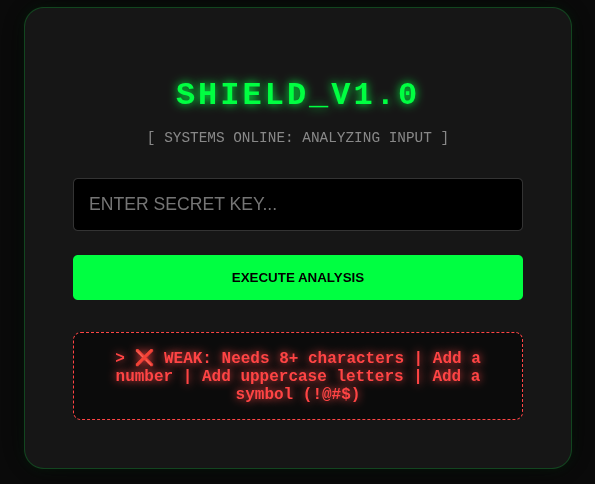
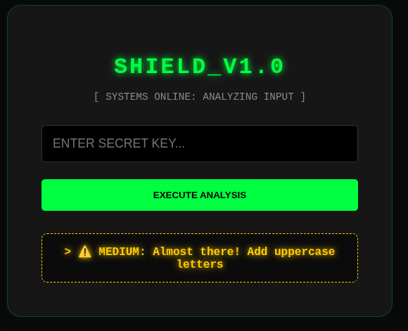
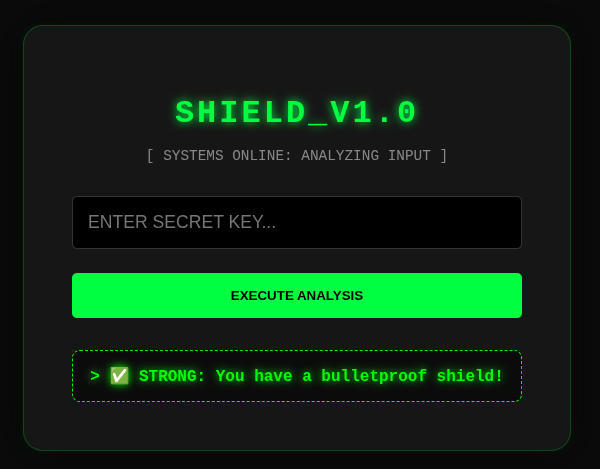

# 🛡️ SHIELD_v1.0 | Cyber Password Guardian

SHIELD_v1.0 is a high-performance web application designed to analyze password entropy and security strength. Built with a "Hacker-Aesthetic" UI, it provides real-time feedback on password vulnerabilities using a Python-based logic engine.

---

## 📸 Security Analysis Showcase

### 🔴 WEAK STATUS

*Identifies short or common passwords that are vulnerable to brute-force attacks.*

### 🟡 MEDIUM STATUS

*Analyzes missing complexity requirements like uppercase letters or digits.*

### 🟢 STRONG STATUS (MAXIMUM SHIELD)

*Confirms the password meets elite security standards with high complexity.*

---

## 🚀 Key Features
- **Regex-Powered Logic:** Advanced pattern matching for length, symbols, numbers, and case.
- **Neon-Cyber UI:** Sleek Glassmorphism design with dynamic glowing status indicators.
- **Flask Backend:** Professional Python integration for rapid request handling.
- **Developer Ready:** Fully documented and organized for open-source contributions.

---

## 🛠️ Installation & Setup (For Developers)

Follow these steps to deploy the SHIELD on your local machine:

### 1. Download the Repository
Clone or download this folder to your local drive.

### 2. Create a Virtual Environment
Isolate your project dependencies to keep your system clean:
```bash
python3 -m venv venv
source venv/bin/activate